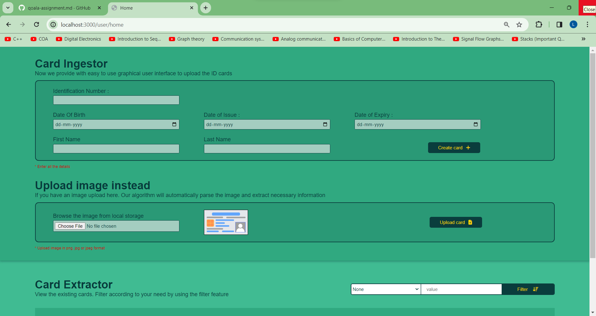

# Project Name
Thai id card OCR

# Table of contents
- Description
  - Home page
  - CRUD page
- API endpoints
  - Create
  - Read
  - Update
  - Delete
- Technology used
- Requirements
- Meta information of project

# Description
The website is a two page website
- Home page
- CRUD page
- CRUD API endpoints

## Home page
The page contains a option to uploadd an image of id card. By which it will automatically extract the necessary information and enter it in the database.
It also has an form to manually fill incase the image recognisation fails.

Then by scrolling down one can see a scrollable view which displays all the inserted idcards in the database. You can filter them on basis of certain keys from the filter attribute.
Two small icons (edit,delete) can edit and delete the card

## CRUD page
first the user clicks on the edit option on any card option this page will open. This page contains all the options to edit the feilds. Also delete functionality is implemented.

## API endpoints
There are many internal endpoints which user doesnt need to know but the one to offer to public related to CRUD on Id cards are as follows :-
- Create: http://localhoost:3000/card, This is a put type request type
 
  The card data has to be sent in json format in the body of the request

- Read: http://localhost:3000/:identification_number, this a get request type  
  The endpoint will return a json object in earlier mentioned format in the result feild of the response with the mentioned identification_key
- Update: http://localhoost:3000/:identification_number, this is a post request type  
  This endpoint will update the card record with mentioned identification_number. The feilds to be updated will be defined in the body of the request
- Delete: http://localhoost:3000/:identification_number, this is a DELETE request type  
  This endpoint will delete the card record with the mentioned identification_number

# Technology used
- Frontend
  - HTML and embededJavaScript
  - CSS
  - JavaScript
  - Google vision API
- Backend
 - Express
 - MongoDB

# Requirements to run
To run the server in your local system...
- NodeJS is a must to start the project 
to initilise the node modules run : "npm init" in your terminal and 
install all nodepackages used in to project: "npm install" and "yarn install" 
This will install all the packages mentioned in the package.json file
- The code wont run straight away as the evvironment variables are not shared publicially with the project on github for security reasons 
so make a .evn file of your own and add the following
  - HOST
  - PORT
  - DATABASE_LINK
  - DATABASE_PASSWORD
  - GOOGLE_VISION_API_KEY

# Meta information of project
- The project is of web development in javascript 
- MongoDB is used as database to store cardRecord. Each cardRecord has a unique identification number associated to it on basis of which the CRUD operations mainly takes place i.e. identification_number is the main primary key of the database
- You need to install NodeJS to run it in local system
- Also you need to create a mongoDB account and enter your DATABASE_LINK and DATABASE_PASSWORD as environment variables
